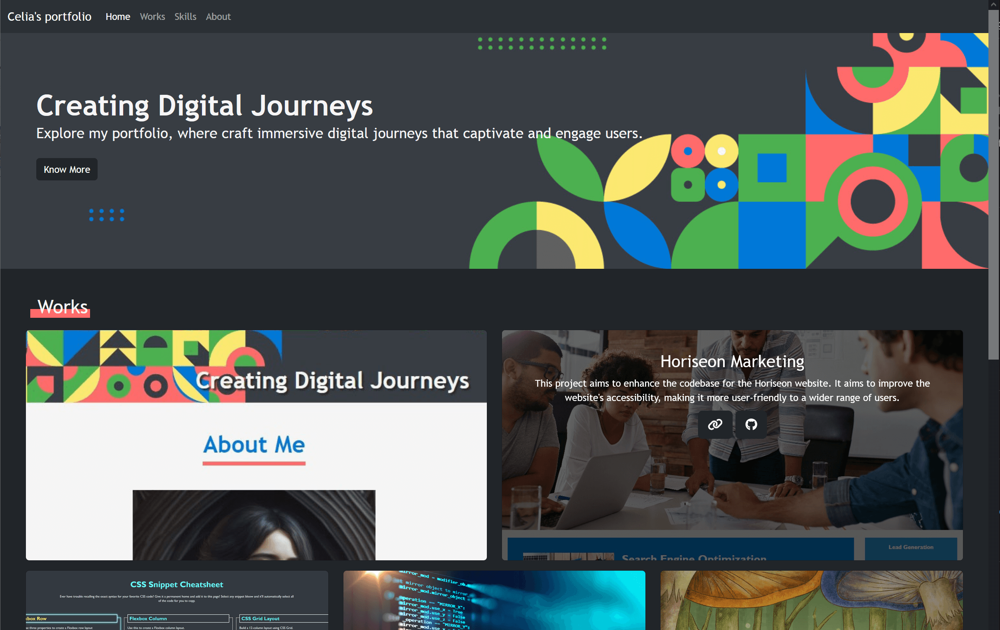
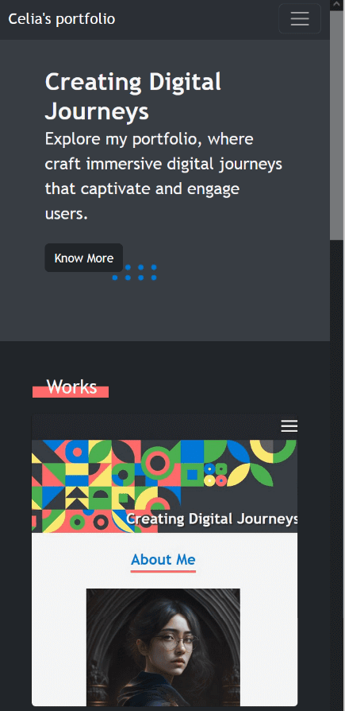

# LSTART-Bootstrap-Portfolio

## Description

This project demonstrates the creation of a visually attractive and responsive portfolio layout utilizing the Bootstrap CSS Framework. It builds upon a previous project, combining HTML and CSS with additional FontAwesome framework for icons. The portfolio provides visitors with information about my background, skills, work, and experiences.

## Folder Structure

- **index.html**: The Main HTML file for my portfolio.
- **asset:** includes 2 subfolders for styles (css) & images
  - **css:** css file for styling
  - **img:** images files for website
- **README.md:** This file.
- **Bootstrap-Screenshot1.jpg:** Screenshot for the HTML file.
- **Bootstrap-Screenshot2.jpg:** Mobile version screenshot for the HTML file.

## Links

[Visit my application](https://celia103.github.io/LSTART-Bootstrap-Portfolio/)

[Visit the GitHub repository](https://github.com/celia103/LSTART-Bootstrap-Portfolio)

- Application Screenshot:
  

- Application Screenshot (Mobile):
  

## License

MIT License

## Self-study Reference

- **For Works section (text overlays):**
  https://www.matthinchliffe.dev/2013/12/16/smooth-text-overlays-with-css-transforms.html

## Image Sources

- **From Midjourney:** avatar.png
- **From Freepik (with license):** bg.jpg(modifed), java.jpg
- **My own work:** cheatsheet.png, horiseon.jpg, illustration.jpg
